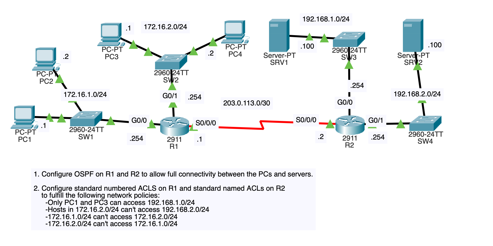

# ACL – Standard and Extended Access Control Lists

Cisco Packet Tracer lab completed while following Jeremy's CCNA course.

## What I Configured

### 1. OSPF
- Configured OSPF on R1 and R2.
- Verified connectivity between PCs and servers before applying ACLs.

### 2. Standard ACLs
Configured numbered standard ACLs on R1 and named standard ACLs on R2 to control traffic based on source IP addresses.

Network policies:
- Allow only PC1 and PC3 to access `192.168.1.0/24`.
- Block traffic from `172.16.2.0/24` to `192.168.2.0/24`.
- Block traffic between `172.16.1.0/24` and `172.16.2.0/24` in both directions.



### 3. Extended ACLs
Configured extended ACLs to control traffic based on source, destination, and specific services.

Network policies:
- Block `172.16.2.0/24` from communicating with PC1.
- Block `172.16.1.0/24` from accessing the DNS service on SRV1.
- Block `172.16.2.0/24` from accessing HTTP and HTTPS services on SRV2.

## Troubleshooting & Verification

- Tested connectivity before and after applying ACLs.
- Checked ACL rules and their order.
- Verified router configurations and ACL matches.
- Used ping and service testing to check whether traffic was permitted or denied.

Useful commands:

```text
show access-lists
show ip interface
show ip route
show running-config
```

## What I Learned

- The difference between standard and extended ACLs.
- How numbered and named ACLs are configured.
- How ACL placement and direction affect traffic filtering.
- How to use wildcard masks to match network addresses.
- How to filter traffic by IP address and services such as DNS, HTTP, and HTTPS.
- How ACLs work alongside OSPF to control access without replacing the routing configuration.

This lab helped me practice implementing network access policies and troubleshooting connectivity using Cisco IOS commands.